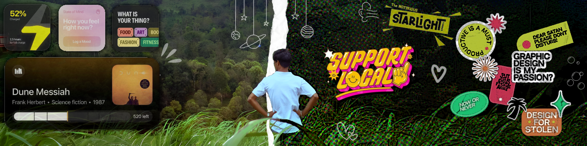

<!-- Banner stays as-is -->

  

<!-- Name image with light/dark mode -->

  <picture>
    <source srcset="public/images/name-dark.png" media="(prefers-color-scheme: dark)">
    
  </picture>

<!-- About image with light/dark mode -->

  <picture>
    <source width="300" srcset="public/images/about-dark.png" media="(prefers-color-scheme: dark)">
    
  </picture>
    
🌟 I’m Thinakaran Manokaran, a creator who loves turning ideas into meaningful digital experiences. I thrive on building intuitive, impactful solutions that blend creativity with precision ✨. Always curious and driven, I embrace challenges, explore new possibilities, and aim to make every project both smart and engaging ⚡. 👼 I love to learn new subjects, 🥇 I’m passionate about cracking mathematical challenges, 🏏 an enthusiastic cricket aficionado, 🤠 a fan of Western film classics, 🧘🏻 I enjoy exploring detective novels, 🕵️‍♂️ sometimes feel like Sherlock Holmes, 🤔 constantly thinking, ☕ sipping coffee, 🎨 designing, 🎮 playing AAA games, and ✨ listening to fairytales feels like heaven.

<!-- Contact image with light/dark mode -->

  <picture>
    <source srcset="public/images/contact-dark.png" media="(prefers-color-scheme: dark)" width="300">
    
  </picture>

  
  
  
  

    

# 💻 Tech Stack:
                   
# 📊 GitHub Stats:
 
 

## 🏆 GitHub Trophies

### ✍️ Random Dev Quote

### 🔝 Top Contributed Repo

---

<!-- Proudly created with GPRM ( https://gprm.itsvg.in ) -->

