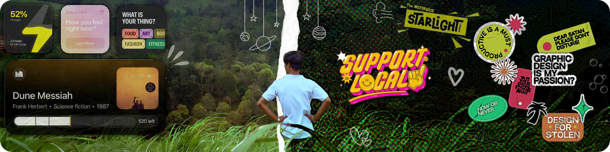
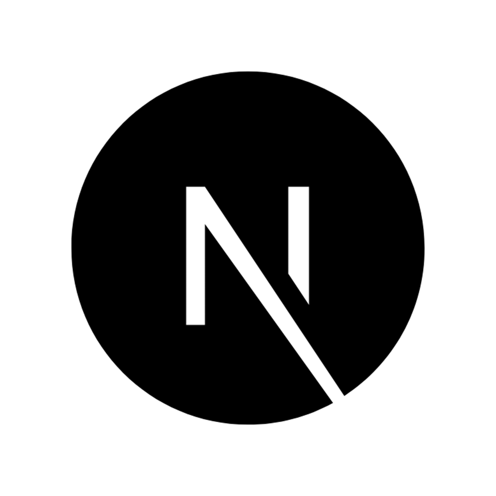
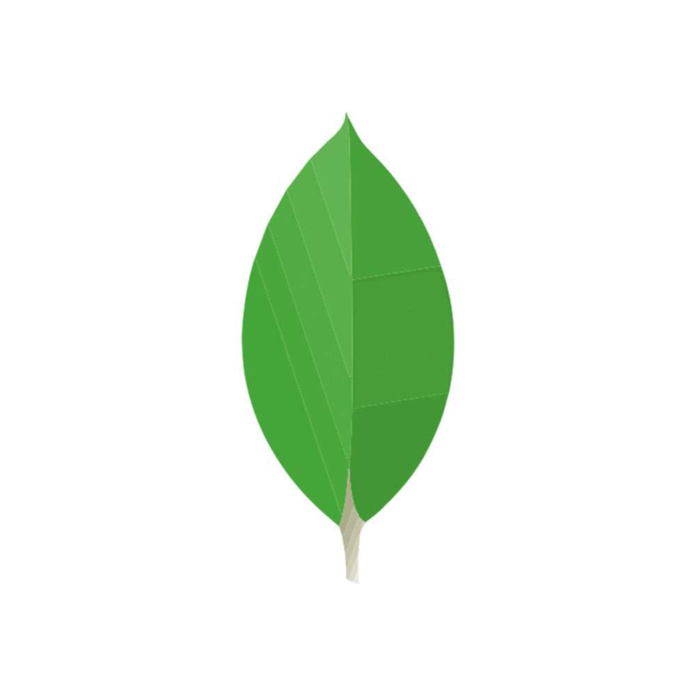

<!-- Banner stays as-is -->

  

<!-- Name image with light/dark mode -->

  <picture>
    <source srcset="public/images/name-dark.png" media="(prefers-color-scheme: dark)">
    
  </picture>

  Open this Profile on Prettyhub 

 

<!-- About image with light/dark mode -->

  <picture>
    <source width="300" srcset="public/images/about-dark.png" media="(prefers-color-scheme: dark)">
    
  </picture>
    <h2 align="center" style="font-weight: normal">🌟 I’m Thinakaran Manokaran, a creator who loves turning ideas into meaningful digital experiences. I thrive on building intuitive, impactful solutions that blend creativity with precision ✨. Always curious and driven, I embrace challenges, explore new possibilities, and aim to make every project both smart and engaging ⚡. 👼 I love to learn new subjects, 🥇 I’m passionate about cracking mathematical challenges, 🏏 an enthusiastic cricket aficionado, 🤠 a fan of Western film classics, 🧘🏻 I enjoy exploring detective novels, 🕵️‍♂️ sometimes feel like Sherlock Holmes, 🤔 constantly thinking, ☕ sipping coffee, 🎨 designing, 🎮 playing AAA games, and ✨ listening to fairytales feels like heaven.</h2>

 

 

<!-- Contact image with light/dark mode -->

  <picture>
    <source srcset="public/images/contact-dark.png" media="(prefers-color-scheme: dark)" width="300">
    
  </picture>

  
  
  
  

 

 

  <picture>
    <source srcset="public/images/skills-dark.png" media="(prefers-color-scheme: dark)" width="220">
    
  </picture>

  
  
  
  
  
  
  
  
  
  
  
  
  
  
  
  

 

 

  <picture>
    <source srcset="public/images/stats-dark.png" media="(prefers-color-scheme: dark)" width="200">
    
  </picture>

  <!-- First row -->
  

    <picture title="Totla Stars">
      <source srcset="https://thinakaran-github.onrender.com/light/stars.svg" media="(prefers-color-scheme: dark)">
      
    </picture>
    <picture title="No.of Stars in Top Repo">
      <source srcset="https://thinakaran-github.onrender.com/light/top-starred.svg" media="(prefers-color-scheme: dark)">
      
    </picture>
    <picture title="Total Followers">
      <source srcset="https://thinakaran-github.onrender.com/light/followers.svg" media="(prefers-color-scheme: dark)">
      
    </picture>
  

  <!-- Second row: 3 stats -->
  

    <picture title="Current Week Commits">
      <source srcset="https://thinakaran-github.onrender.com/light/current-week-commits.svg" media="(prefers-color-scheme: dark)">
      
    </picture>
    <picture title="Current Streak">
      <source srcset="https://thinakaran-github.onrender.com/light/streaks.svg" media="(prefers-color-scheme: dark)">
      
    </picture>
    <picture title="Long Streak Maintained">
      <source srcset="https://thinakaran-github.onrender.com/light/long-streaks.svg" media="(prefers-color-scheme: dark)">
      
    </picture>
  

 

 

  <picture>
    <source srcset="public/images/achieve-dark.png" media="(prefers-color-scheme: dark)" width="470">
    
  </picture>

  

    <picture title="GalaxyBrain: Creative problem-solving and innovative contributions.">
      <source srcset="public/images/achievements/GalaxyBrain-dark.png" media="(prefers-color-scheme: dark)">
      
    </picture>
    <picture title="PairExtraordinaire: Outstanding teamwork in pair programming sessions.">
      <source srcset="public/images/achievements/PairExtraordinaire-dark.png" media="(prefers-color-scheme: dark)">
      
    </picture>
    <picture title="PullShark: High-quality pull requests merged promptly.">
      <source srcset="public/images/achievements/PullShark-dark.png" media="(prefers-color-scheme: dark)">
      
    </picture>
    <picture title="QuickDraw: Fast and precise completion of coding challenges.">
      <source srcset="public/images/achievements/QuickDraw_dark.png" media="(prefers-color-scheme: dark)">
      
    </picture>
    <picture title="StarStruck: Gained recognition from the community via stars.">
      <source srcset="public/images/achievements/StarStruck-dark.png" media="(prefers-color-scheme: dark)">
      
    </picture>
    <picture title="YOLO Badge: Bold contributions pushing project boundaries.">
      <source srcset="public/images/achievements/YOLO_Badge-dark.png" media="(prefers-color-scheme: dark)">
      
    </picture>
  

